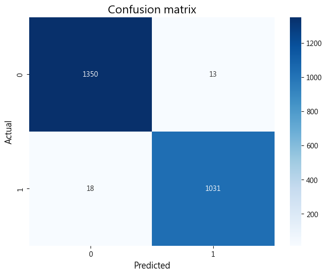
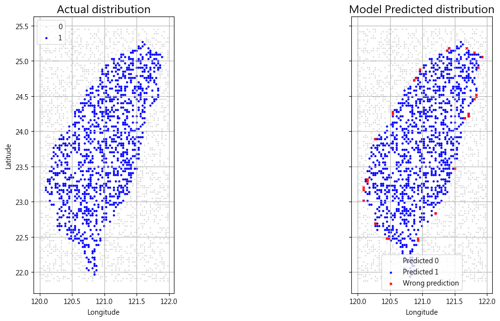
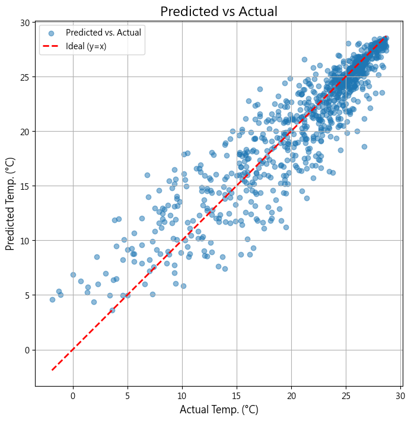
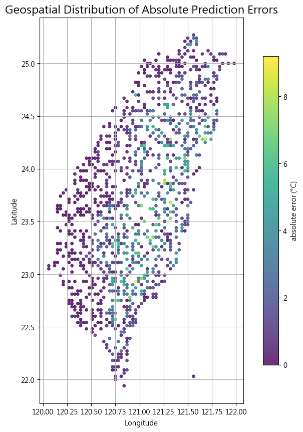

# HW4 Report
> 112652011 廖晨鈞

## Objective
The objective of this homework is to develop two supervised learning models using gridded temperature data from the Central Weather Administration (CWA).

1.  Classification Model: Predicts whether a grid point at a given `(longitude, latitude)` has a valid temperature.
2.  Regression Model: Predicts the temperature for valid grid points based on their `(longitude, latitude)`.

At the first place, we have to load in and parse the XML file.

## Data Preparation

The raw data was parsed from an XML file (`O-A0038-003.xml`) into a structured format.

*   **Classification Dataset:**
    *   **Features:** `(longitude, latitude)`
    *   **Label:** `1` if the temperature is valid, `0` if it is an invalid value (`-999.0`).
*   **Regression Dataset:**
    *   **Features:** `(longitude, latitude)`
    *   **Target:** `temperature` (°C).
    *   This dataset was created by filtering out all invalid data points.

##  Model & Training

**Random Forest** was chosen for both tasks due to its high performance.
Also, it was rather simpler and suitable for handling both classification and regression.

Specification of Random forest (both classification and regression):
- `n_estimators = 100`
- `random_state = 42`

**Training Process:**
1.  The data was split into a 70% training set and a 30% test set.
    - Total: 8040 data points.
2.  A `RandomForestClassifier` and a `RandomForestRegressor` (with 100 trees each) were trained on their respective training sets.
3.  Model performance was evaluated on the unseen test set to ensure a fair assessment.

> LLM is used for giving explanations and generating the structure of the code to help better understanding. 

## Results
### **1. Classification model**

The model achieved an overall accuracy of 99.3%. For the minority class (valid data, Label 1), it achieved a Precision of 0.99 and a Recall of 0.98, indicating it is both highly reliable and rarely misses valid data points.

The geospatial distribution show that the prediction errors are minimal and primarily occur at the edges of this boundary. (The ratio of vertical and horizontal grid is set to $\frac{1}{\cos(23.5^\circ)}$, since the higher the lattitude, the narrower the longitude)

### **2. Regression model**
Root Mean Squared Error (RMSE): 0.473 °C, the average error of the model's temperature predictions.

R-squared (R²): 0.981.

The following plot shows data points tightly clustered around the $y=x$ line, confirming the model's high accuracy.

The geospatial error map reveals a major problem: prediction errors are significantly larger in the **Central Mountain Range** of Taiwan. This is because the model, using only 2D coordinates, is unaware of **altitude**, which is a critical factor influencing temperature.

